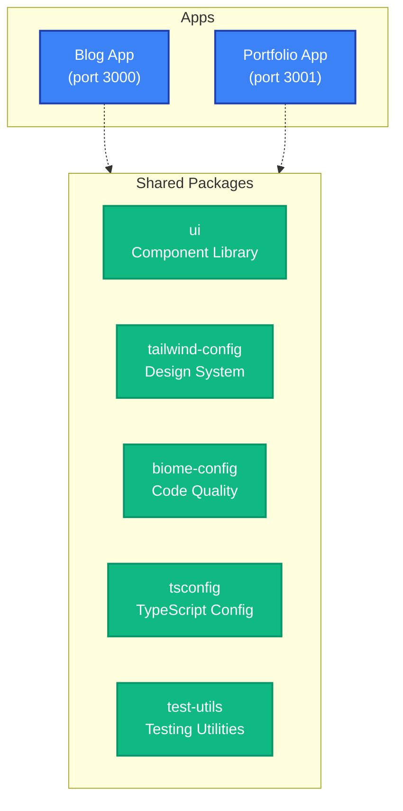
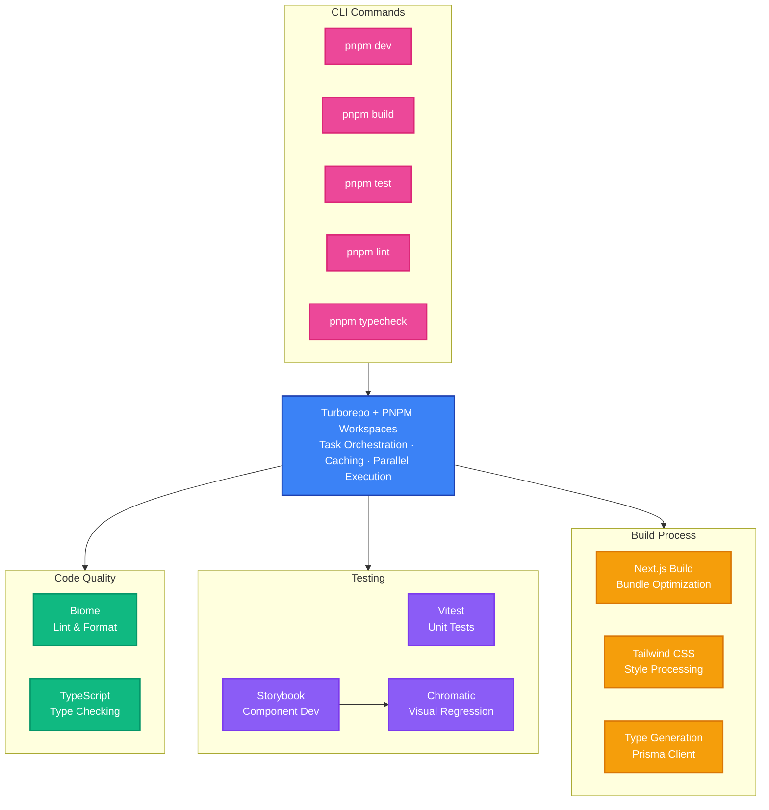

# K2BG Branding

A modern **Turborepo monorepo** for K2BG Branding containing a technology blog and multilingual portfolio website built with Next.js and TypeScript.

## What's Inside

### Applications

- **[Blog](apps/blog/README.md)** - Next.js blog with Notion CMS and Clean Architecture (port 3000)
- **[Portfolio](apps/portfolio/README.md)** - Multilingual portfolio with i18next (port 3001)

### Shared Packages

- **`ui`** - React component library with Storybook documentation
- **`tailwind-config`** - Shared Tailwind CSS configuration and design tokens
- **`biome-config`** - Shared Biome configurations
- **`tsconfig`** - TypeScript configurations used throughout the monorepo
- **`test-utils`** - Shared testing utilities with Vitest

Each package/app is 100% [TypeScript](https://www.typescriptlang.org/).

## Technology Stack

- **[Next.js 15](https://nextjs.org/)** - React framework for both applications
- **[TypeScript](https://www.typescriptlang.org/)** - Static type checking
- **[Tailwind CSS v4](https://tailwindcss.com/)** - Utility-first CSS framework
- **[Turborepo](https://turbo.build/repo)** - Monorepo build system
- **[pnpm](https://pnpm.io/)** - Package manager

## Getting Started

### Prerequisites

- Node.js 18+
- pnpm 9.15.9+

### Installation

```bash
git clone <repository-url>
cd k2bg-branding
pnpm install
```

## Development

### Start All Applications

```bash
pnpm dev          # Start both blog (3000) and portfolio (3001) apps
```

### Start Individual Applications

```bash
pnpm dev --filter=blog        # Blog app only
pnpm dev --filter=portfolio   # Portfolio app only
```

### Component Development

```bash
pnpm storybook             # Start Storybook for UI package
pnpm build-storybook       # Build Storybook
pnpm chromatic             # Visual regression testing
pnpm generate:component    # Generate new component scaffolding
pnpm generate:style        # Generate style files from design tokens
```

## Build & Production

```bash
pnpm build        # Build all apps and packages
pnpm start        # Start production builds
```

## Testing & Quality

```bash
pnpm test         # Run tests across all packages
pnpm test:watch   # Run tests in watch mode
pnpm lint         # Lint and format all apps and packages with Biome
pnpm typecheck    # TypeScript type checking
pnpm format       # Format code with Biome
```

## Monorepo Architecture

### Overview



### Development & Build Pipeline



## Useful Links

- [Turborepo Documentation](https://turbo.build/repo/docs)
- [Next.js Documentation](https://nextjs.org/docs)
- [Tailwind CSS Documentation](https://tailwindcss.com/docs)
- [Storybook Documentation](https://storybook.js.org/docs)
