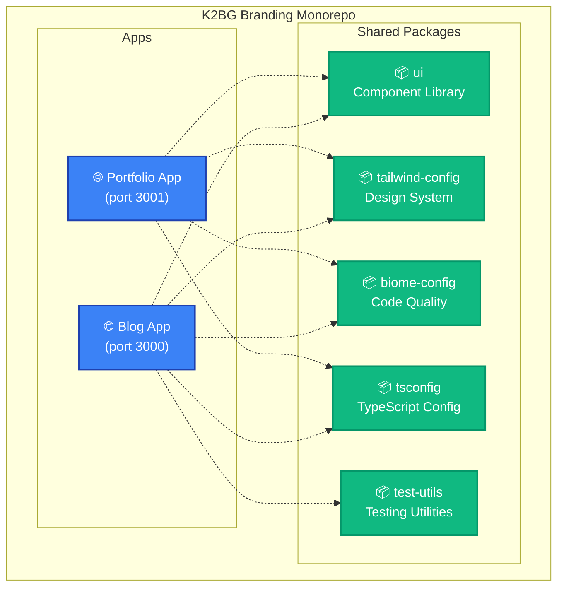
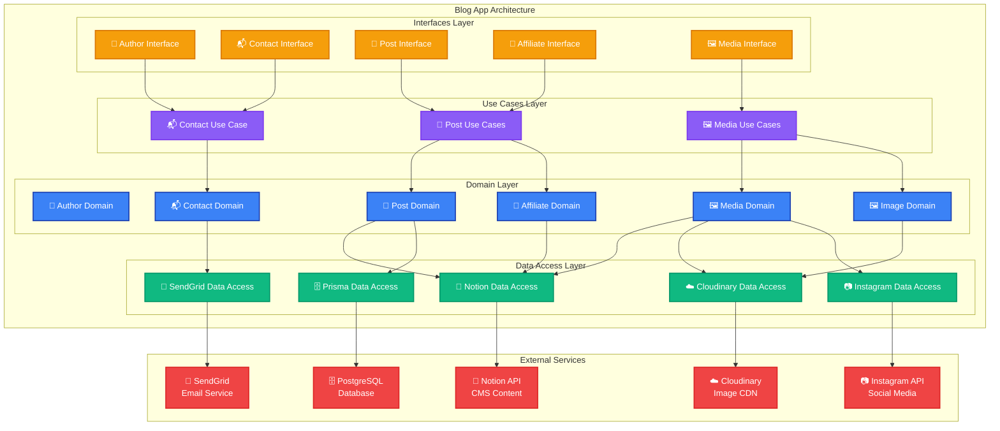
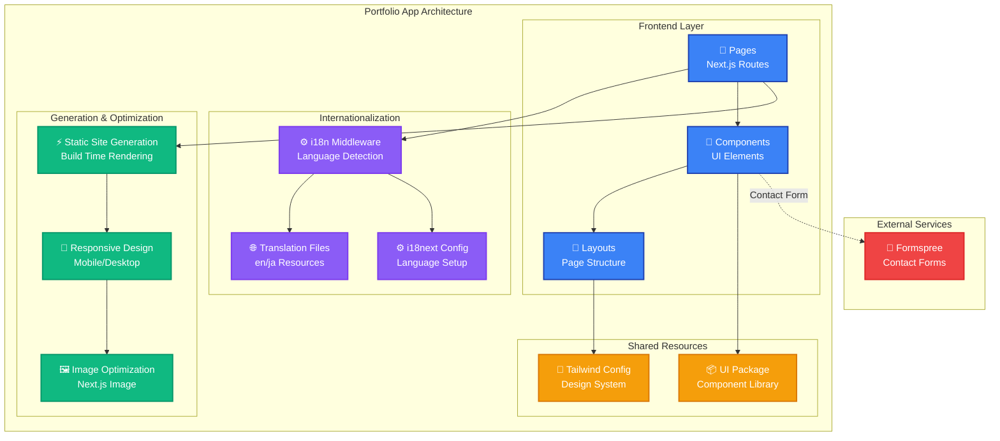
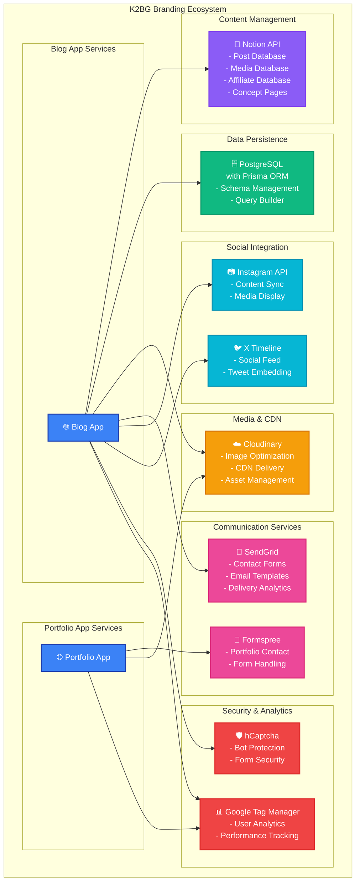
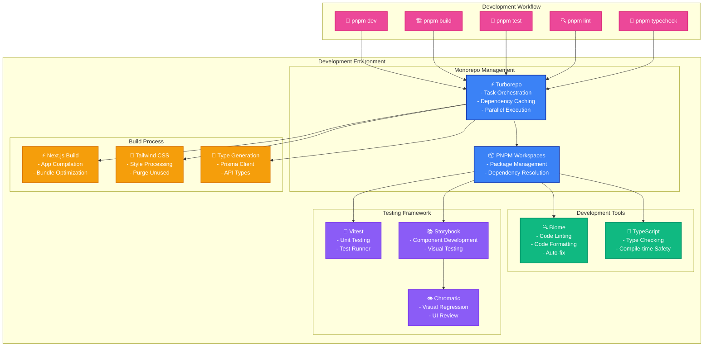

# K2BG Branding

A modern **Turborepo monorepo** for K2BG Branding containing a technology blog and multilingual portfolio website built with Next.js and TypeScript.

## 🚀 What's inside?

This monorepo includes the following applications and packages:

### 📱 Applications

- **`blog`** - Next.js blog application with Notion CMS integration (port 3000)
- **`portfolio`** - Multilingual portfolio website with i18next (port 3001)

### 📦 Packages

- **`ui`** - React component library with Storybook documentation
- **`tailwind-config`** - Shared Tailwind CSS configuration and design tokens
- **`biome-config`** - Shared Biome configurations
- **`tsconfig`** - TypeScript configurations used throughout the monorepo
- **`test-utils`** - Shared testing utilities with Vitest

Each package/app is 100% [TypeScript](https://www.typescriptlang.org/).

## 🛠️ Technology Stack

### Core Technologies

- **[Next.js](https://nextjs.org/)** - React framework for both applications
- **[TypeScript](https://www.typescriptlang.org/)** - Static type checking
- **[Tailwind CSS](https://tailwindcss.com/)** - Utility-first CSS framework
- **[Turborepo](https://turbo.build/repo)** - Monorepo build system

### Blog App Integrations

- **[Notion API](https://developers.notion.com/)** - Content management system
- **[Prisma](https://www.prisma.io/)** + **PostgreSQL** - Database ORM and persistence
- **[Cloudinary](https://cloudinary.com/)** - Image optimization and CDN
- **[SendGrid](https://sendgrid.com/)** - Email service for contact forms
- **[Instagram Basic Display API](https://developers.facebook.com/docs/instagram-basic-display-api)** - Social media integration

### Portfolio App Features

- **[react-i18next](https://react.i18next.com/)** - Internationalization (English/Japanese)
- **[Formspree](https://formspree.io/)** - Contact form handling

### Development Tools

- **[Biome](https://biomejs.dev/)** - Code linting and formatting
- **[Vitest](https://vitest.dev/)** - Unit testing framework
- **[Storybook](https://storybook.js.org/)** - Component development and documentation

## 🚀 Getting Started

### Prerequisites

- Node.js 18+
- pnpm 8.6.10+

### Installation

```bash
# Clone the repository
git clone <repository-url>
cd k2bg-branding

# Install dependencies
pnpm install
```

## 🏃‍♂️ Development

### Start All Applications

```bash
pnpm dev          # Start both blog (3000) and portfolio (3001) apps
```

### Start Individual Applications

```bash
# Blog app only
pnpm dev --filter=blog

# Portfolio app only
pnpm dev --filter=portfolio
```

### Component Development

```bash
pnpm storybook             # Start Storybook for UI package
pnpm build-storybook       # Build Storybook
pnpm chromatic             # Visual regression testing
```

## 🏗️ Build & Production

```bash
pnpm build        # Build all apps and packages
pnpm start         # Start production builds
```

## 🧪 Testing & Quality

```bash
pnpm test         # Run tests across all packages
pnpm test:watch   # Run tests in watch mode
pnpm lint         # Lint and format all apps and packages with Biome
pnpm typecheck    # TypeScript type checking
pnpm format       # Format code with Biome
```

## 🏛️ Architecture

### Monorepo Overview



### Blog App Clean Architecture



### Portfolio App Architecture



### External Services Integration



### Development & Build Pipeline



### Blog App - Clean Architecture Pattern

The blog application follows a layered architecture with clear separation of concerns:

- **`modules/domain/`** - Business entities and core logic
- **`modules/data-access/`** - External integrations (Notion, Prisma, Cloudinary, SendGrid)
- **`modules/use-cases/`** - Application business rules
- **`modules/interfaces/`** - Input validation and adapters

### Portfolio App

- Internationalized routing with middleware for language detection
- Static site generation for optimal performance
- Responsive design optimized for mobile and desktop

## 🗄️ Database

The blog app uses **Prisma** with PostgreSQL. Key commands:

```bash
cd apps/blog
npx prisma generate    # Generate Prisma client
npx prisma migrate dev # Run migrations
npx prisma studio      # Open database browser
```

### Local Database (Docker)

You can run PostgreSQL locally using Docker for development.

#### Start

```bash
docker compose up -d
```

#### Stop

```bash
docker compose down
```

#### Initial Setup

```bash
# 1. Start PostgreSQL
docker compose up -d

# 2. Set up environment variables
cp apps/blog/.env.local.example apps/blog/.env.local
# Or add DATABASE_URL to your existing .env file

# 3. Run migrations
cd apps/blog && npx prisma migrate dev
```

#### Reset Database

```bash
docker compose down
rm -rf .docker/postgres/data
docker compose up -d
cd apps/blog && npx prisma migrate dev
```

## ⚙️ Environment Setup

### Required Environment Variables

Create `.env.local` files in the respective app directories with the following variables:

#### Blog App (`apps/blog/.env.local`)

```bash
# Notion CMS
NOTION_TOKEN=your_notion_token
NOTION_POST_DATABASE_ID=your_post_database_id
NOTION_MEDIA_DATABASE_ID=your_media_database_id
NOTION_AFFILIATE_DATABASE_ID=your_affiliate_database_id
NOTION_CONCEPT_PAGE_ID=your_concept_page_id

# Database
DATABASE_URL=your_postgresql_connection_string

# Image Management
CLOUDINARY_CLOUD_NAME=your_cloud_name
CLOUDINARY_API_KEY=your_api_key
CLOUDINARY_API_SECRET=your_api_secret

# Email Service
SEND_GRID_API_KEY=your_sendgrid_api_key
SEND_GRID_SINGLE_SENDER_DOMAIN=your_domain

# Social Media
INSTAGRAM_LONG_ACCESS_TOKEN=your_instagram_token
NEXT_PUBLIC_X_TIMELINE_URL=your_x_timeline_url

# Security
NEXT_PUBLIC_H_CAPTCHA_SITE_KEY=your_hcaptcha_site_key
H_CAPTCHA_SECRET=your_hcaptcha_secret

# Analytics
GOOGLE_TAG_MANAGER_ID=your_gtm_id
```

#### Portfolio App (`apps/portfolio/.env.local`)

```bash
# Contact Form
FORMSPREE_FORM_ACTION_URL=your_formspree_url
```

## 📚 Useful Links

Learn more about the technologies used:

- [Turborepo Documentation](https://turbo.build/repo/docs)
- [Next.js Documentation](https://nextjs.org/docs)
- [Notion API Documentation](https://developers.notion.com/)
- [Prisma Documentation](https://www.prisma.io/docs)
- [Tailwind CSS Documentation](https://tailwindcss.com/docs)
- [Storybook Documentation](https://storybook.js.org/docs)
