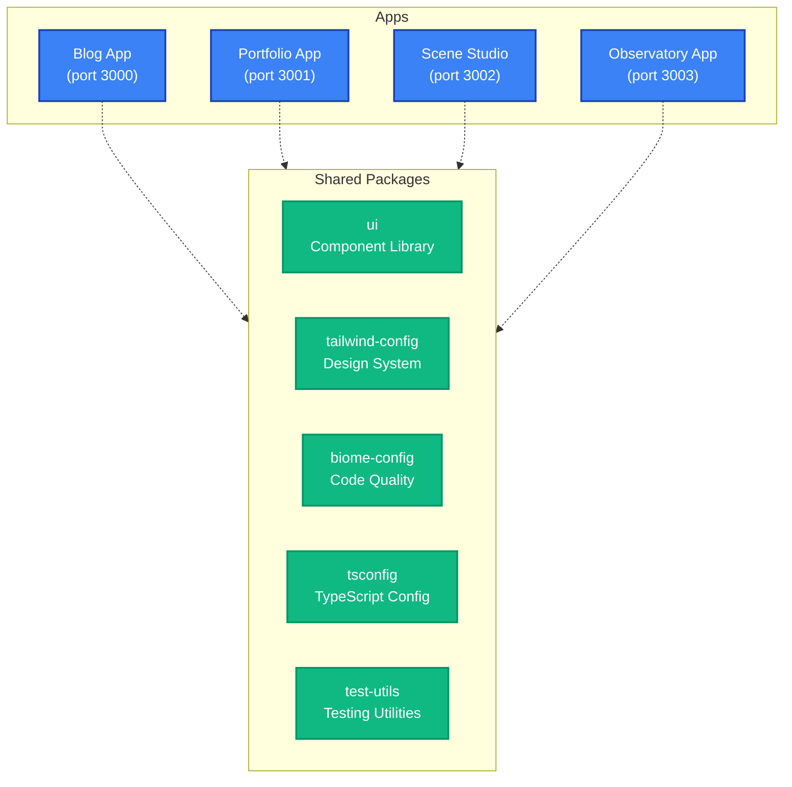
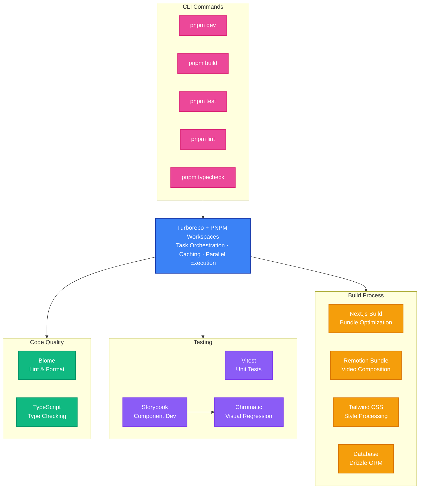

# K2BG Branding

A modern **Turborepo monorepo** for K2BG Branding containing a technology blog,
multilingual portfolio, programmatic video studio, and personal data visualization
app built with TypeScript.

## What's Inside

### Applications

- **[Blog](apps/blog/README.md)** - Next.js blog with Notion CMS and Clean Architecture (port 3000)
- **[Portfolio](apps/portfolio/README.md)** - Multilingual portfolio with server-only dictionary-based internationalization (port 3001)
- **[Scene Studio](apps/scene-studio/README.md)** - Remotion studio for data-driven short-form video compositions (port 3002)
- **[Observatory](apps/observatory/README.md)** - Personal data visualization app for finances, health, home environment, and web analytics (port 3003)

### Shared Packages

- **`ui`** - React component library with Storybook documentation
- **`tailwind-config`** - Shared Tailwind CSS configuration and design tokens
- **`biome-config`** - Shared Biome configurations
- **`tsconfig`** - TypeScript configurations used throughout the monorepo
- **`test-utils`** - Shared testing utilities with Vitest

Each package/app is 100% [TypeScript](https://www.typescriptlang.org/).

## Technology Stack

- **[Next.js](https://nextjs.org/)** - React framework for the blog, portfolio, and observatory applications (Turbopack, React Compiler)
- **[Remotion](https://www.remotion.dev/)** - React framework for programmatic video rendering
- **[TypeScript](https://www.typescriptlang.org/)** - Static type checking
- **[Tailwind CSS v4](https://tailwindcss.com/)** - Utility-first CSS framework
- **[Turborepo](https://turbo.build/repo)** - Monorepo build system
- **[pnpm](https://pnpm.io/)** - Package manager

## Getting Started

### Prerequisites

- Node.js 20.9+
- pnpm 10.33.2+

### Installation

```bash
git clone <repository-url>
cd k2bg-branding
pnpm install
```

## Development

### Start All Applications

```bash
pnpm dev          # Start all development applications
```

### Start Individual Applications

```bash
pnpm -F blog dev           # Blog app (port 3000)
pnpm -F portfolio dev      # Portfolio app (port 3001)
pnpm -F scene-studio dev   # Scene Studio (port 3002)
pnpm -F observatory dev    # Observatory app (port 3003)
```

### Component Development

```bash
pnpm storybook             # Start Storybook for UI package
pnpm build-storybook       # Build Storybook
pnpm chromatic             # Visual regression testing
pnpm generate:component    # Generate new component scaffolding
pnpm generate:style        # Generate style files from design tokens
```

## Build & Production

```bash
pnpm build        # Build all apps and packages
pnpm start        # Start production builds
```

## Testing & Quality

```bash
pnpm test         # Run tests across all packages
pnpm test:watch   # Run tests in watch mode
pnpm lint         # Lint and format all apps and packages with Biome
pnpm typecheck    # TypeScript type checking
pnpm format       # Format code with Biome
```

## Monorepo Architecture

### Overview


```mermaid
flowchart TB
    subgraph apps["Apps"]
        Blog["Blog App<br/>(port 3000)"]
        Portfolio["Portfolio App<br/>(port 3001)"]
        SceneStudio["Scene Studio<br/>(port 3002)"]
        Observatory["Observatory App<br/>(port 3003)"]
    end

    subgraph packages["Shared Packages"]
        UI["ui<br/>Component Library"]
        TailwindConfig["tailwind-config<br/>Design System"]
        BiomeConfig["biome-config<br/>Code Quality"]
        TSConfig["tsconfig<br/>TypeScript Config"]
        TestUtils["test-utils<br/>Testing Utilities"]
    end

    Blog -.-> packages
    Portfolio -.-> packages
    SceneStudio -.-> packages
    Observatory -.-> packages

    classDef appStyle fill:#3B82F6,stroke:#1E40AF,stroke-width:2px,color:#fff
    classDef packageStyle fill:#10B981,stroke:#059669,stroke-width:2px,color:#fff

    class Blog,Portfolio,SceneStudio,Observatory appStyle
    class UI,TailwindConfig,BiomeConfig,TSConfig,TestUtils packageStyle
```

### Development & Build Pipeline


```mermaid
flowchart TB
    subgraph commands["CLI Commands"]
        Dev["pnpm dev"]
        Build["pnpm build"]
        Test["pnpm test"]
        Lint["pnpm lint"]
        TypeCheck["pnpm typecheck"]
    end

    Turbo["Turborepo + PNPM Workspaces<br/>Task Orchestration · Caching · Parallel Execution"]

    subgraph quality["Code Quality"]
        Biome["Biome<br/>Lint & Format"]
        TS["TypeScript<br/>Type Checking"]
    end

    subgraph testing["Testing"]
        Vitest["Vitest<br/>Unit Tests"]
        Storybook["Storybook<br/>Component Dev"]
        Chromatic["Chromatic<br/>Visual Regression"]
    end

    subgraph build["Build Process"]
        NextJS["Next.js Build<br/>Bundle Optimization"]
        Remotion["Remotion Bundle<br/>Video Composition"]
        Tailwind["Tailwind CSS<br/>Style Processing"]
        DrizzleGen["Database<br/>Drizzle ORM"]
    end

    commands --> Turbo
    Turbo --> quality
    Turbo --> testing
    Turbo --> build
    Storybook --> Chromatic

    classDef commandStyle fill:#EC4899,stroke:#DB2777,stroke-width:2px,color:#fff
    classDef turboStyle fill:#3B82F6,stroke:#1E40AF,stroke-width:2px,color:#fff
    classDef qualityStyle fill:#10B981,stroke:#059669,stroke-width:2px,color:#fff
    classDef testStyle fill:#8B5CF6,stroke:#7C3AED,stroke-width:2px,color:#fff
    classDef buildStyle fill:#F59E0B,stroke:#D97706,stroke-width:2px,color:#fff

    class Dev,Build,Test,Lint,TypeCheck commandStyle
    class Turbo turboStyle
    class Biome,TS qualityStyle
    class Vitest,Storybook,Chromatic testStyle
    class NextJS,Remotion,Tailwind,DrizzleGen buildStyle
```

## Contributing

Project conventions and AI-agent instructions (architecture, coding style, testing, commit
and PR rules) live in a single source of truth: **[AGENTS.md](AGENTS.md)**. All AI agents
(Codex, Claude Code, GitHub Copilot) and contributors should follow it.

## Useful Links

- [Turborepo Documentation](https://turbo.build/repo/docs)
- [Next.js Documentation](https://nextjs.org/docs)
- [Tailwind CSS Documentation](https://tailwindcss.com/docs)
- [Storybook Documentation](https://storybook.js.org/docs)
- [Remotion Documentation](https://www.remotion.dev/docs)
