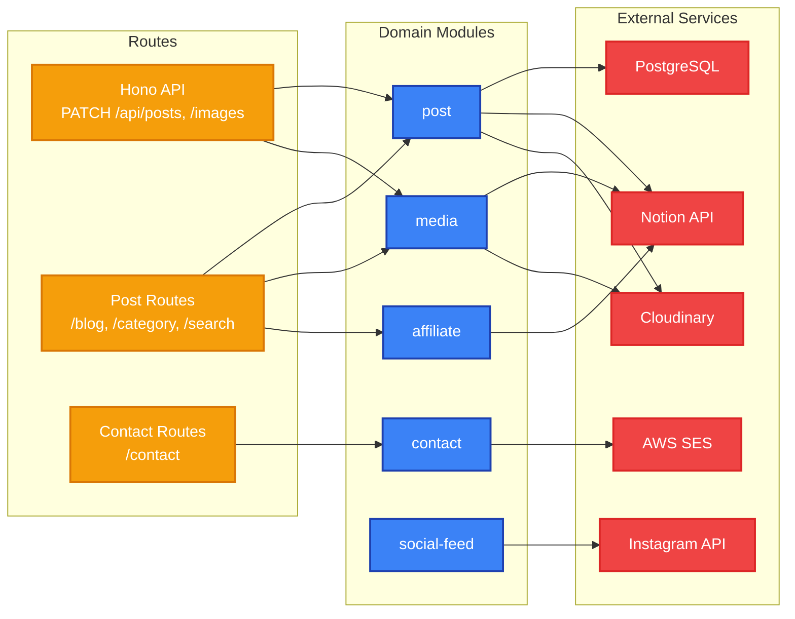
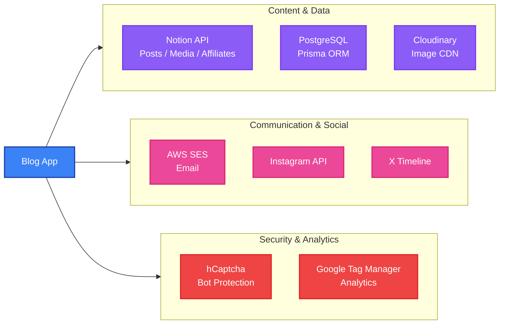

# K2BG Blog

A **Next.js 16** blog application with **Notion CMS** integration, built following **Clean Architecture** and **Domain-Driven Design** principles. Part of the [K2BG Branding monorepo](../../README.md).

## Technology Stack

| Category | Technologies |
|---|---|
| **Framework** | Next.js 16, React 19, TypeScript |
| **API Server** | Hono, @hono/zod-openapi, @hono/swagger-ui |
| **Styling** | Tailwind CSS v4 |
| **Database** | PostgreSQL, Prisma ORM |
| **CMS** | Notion API |
| **Email** | AWS SES |
| **Image CDN** | Cloudinary |
| **State** | Zustand, TanStack React Query |
| **Forms** | React Hook Form, Zod, hCaptcha |
| **Templating** | Handlebars (email templates) |
| **Testing** | Vitest, Testing Library, MSW |
| **Linting** | Biome |
| **Docs** | Storybook 10 |

## Getting Started

### Prerequisites

- Node.js 20.9+
- pnpm 10.33.2+
- PostgreSQL (or Docker)

### Installation

From the monorepo root:

```bash
pnpm install
```

### Development

```bash
# From monorepo root
pnpm dev --filter=blog

# Or from this directory
pnpm dev
```

Open [http://localhost:3000](http://localhost:3000).

### Build

```bash
pnpm build
```

The build runs `prisma generate && next build` to ensure the Prisma client is up to date.

### Storybook

```bash
pnpm storybook
```

Opens on [http://localhost:6007](http://localhost:6007).

### Testing

```bash
pnpm test          # Run once
pnpm test:watch    # Watch mode
```

## Architecture

The blog follows a **Clean Architecture** pattern with vertical slicing by domain module. Each module encapsulates its own domain logic, use cases, and adapters.

### Domain Modules

| Module | Description |
|---|---|
| [post](/apps/blog/specs/post.spec.md) | Blog post management, categories, search |
| `contact` | Contact form handling and email delivery |
| [media](/apps/blog/specs/media.spec.md) | Media asset management |
| [affiliate](/apps/blog/specs/affiliate.spec.md) | Affiliate link and banner management |
| `social-feed` | Social media feed integration (Instagram) |

### Layer Structure

Each module follows the same layered structure:

```
modules/<module>/
  domain/
    entities/          # Domain entities
    value-objects/     # Value objects with validation
    repositories/      # Repository interfaces (ports)
    types/             # Domain types
    errors/            # Domain-specific errors
  use-cases/
    query/             # Read operations (CQRS)
    command/           # Write operations (CQRS)
    sync/              # External data synchronization
  adapters/
    output/            # Infrastructure adapters (implementations)
```

### Use Cases

**Post**
- `fetch-posts` / `fetch-post` / `fetch-posts-by-category` / `fetch-all-slugs` / `search-posts`
- `sync-posts-from-external` / `sync-hero-images`

**Contact**
- `send-email`

**Affiliate**
- `fetch-affiliate` / `fetch-affiliates-by-ids` / `fetch-all-image-sources`

**Media**
- `fetch-media` / `fetch-all-image-sources`

**Social Feed**
- `fetch-feed`

### Adapters

| Adapter | Service | Used By |
|---|---|---|
| Notion | Notion API | post, affiliate, media |
| Prisma | PostgreSQL | post |
| Cloudinary | Cloudinary CDN | post, media |
| AWS SES | Amazon SES | contact |
| Instagram | Instagram API | social-feed |

### Clean Architecture Pattern

Each module follows the same layered pattern. Dependencies flow inward, with adapters implementing domain-defined interfaces (ports):

```mermaid
flowchart LR
    Route["Route Layer<br/>(Next.js / Hono)"] --> UseCase["Use Case Layer<br/>(Query / Command / Sync)"]
    UseCase --> Domain["Domain Layer<br/>(Entity / Value Object)"]
    Domain -.->|"Repository Interface (Port)"| Adapter["Adapter Layer<br/>(Infrastructure)"]
    Adapter --> Service["External Service"]

    classDef routeStyle fill:#F59E0B,stroke:#D97706,stroke-width:2px,color:#fff
    classDef useCaseStyle fill:#8B5CF6,stroke:#7C3AED,stroke-width:2px,color:#fff
    classDef domainStyle fill:#3B82F6,stroke:#1E40AF,stroke-width:2px,color:#fff
    classDef adapterStyle fill:#10B981,stroke:#059669,stroke-width:2px,color:#fff
    classDef externalStyle fill:#EF4444,stroke:#DC2626,stroke-width:2px,color:#fff

    class Route routeStyle
    class UseCase useCaseStyle
    class Domain domainStyle
    class Adapter adapterStyle
    class Service externalStyle
```



### Module Dependencies



### External Services Integration



## API Server (Hono)

The blog app includes a **Hono**-based REST API server that integrates into Next.js via a catch-all route handler (`app/api/[[...route]]/route.ts`).

### Key Features

- **OpenAPIHono** - Type-safe API definitions with `createRoute()` and Zod schemas
- **Swagger UI** - Interactive API documentation at `/api/doc` (non-production only)
- **OpenAPI Spec** - Auto-generated at `/api/doc.json` (non-production only)
- **API Key Authentication** - Request authentication via `x-api-key` header
- **Structured Error Handling** - Centralized error handler with standardized JSON responses
- **Request Logging** - Pino-based request/response logging

### Endpoints

| Method | Path | Description | Auth |
|---|---|---|---|
| `PATCH` | `/api/posts` | Sync posts from Notion to database | `x-api-key` |
| `PATCH` | `/api/images` | Sync hero images to CDN | `x-api-key` |
| `GET` | `/api/doc.json` | OpenAPI specification | None |
| `GET` | `/api/doc` | Swagger UI | None |

### Server Structure

```
server/
├── app.ts                 # OpenAPIHono app setup & routing
├── routes/
│   ├── index.ts           # Route exports
│   ├── post.ts            # PATCH /posts endpoint
│   └── media.ts           # PATCH /images endpoint
├── schemas/
│   ├── shared.ts          # Common schemas (ErrorResponse)
│   ├── post.ts            # Post response schemas
│   └── media.ts           # Media response schemas
└── middleware/
    ├── apiKeyAuth.ts      # API key header validation
    ├── errorHandler.ts    # Centralized error handler
    └── requestLogger.ts   # Request/response logging
```

## Database

### Prisma Commands

```bash
npx prisma generate    # Generate Prisma client
npx prisma migrate dev # Run migrations
npx prisma studio      # Open database browser
```

### Docker Compose (Local PostgreSQL)

Start:

```bash
docker compose up -d
```

Stop:

```bash
docker compose down
```

Initial setup:

```bash
docker compose up -d
npx prisma migrate dev
```

Reset:

```bash
docker compose down
rm -rf .docker/postgres/data
docker compose up -d
npx prisma migrate dev
```

The Docker Compose configuration runs **PostgreSQL 15 Alpine** on port `5432` with database `k2bg_blog`.

## Environment Variables

Create `apps/blog/.env.local`:

```bash
# Notion CMS
NOTION_TOKEN=
NOTION_POST_DATABASE_ID=
NOTION_MEDIA_DATABASE_ID=
NOTION_AFFILIATE_DATABASE_ID=
NOTION_CONCEPT_PAGE_ID=

# Database
DATABASE_URL=

# Image Management
CLOUDINARY_CLOUD_NAME=
CLOUDINARY_API_KEY=
CLOUDINARY_API_SECRET=

# Email Service (AWS SES)
AMAZON_ACCESS_KEY_ID=
AMAZON_SECRET_ACCESS_KEY=
AMAZON_REGION=
AMAZON_SES_SENDER_EMAIL=

# Social Media
INSTAGRAM_LONG_ACCESS_TOKEN=
NEXT_PUBLIC_X_TIMELINE_URL=

# API Server (Hono)
API_KEY=

# Security
NEXT_PUBLIC_H_CAPTCHA_SITE_KEY=
H_CAPTCHA_SECRET=

# Analytics
GOOGLE_TAG_MANAGER_ID=
```

## Project Structure

```
apps/blog/
├── app/                       # Next.js App Router
│   ├── api/[[...route]]/      # Catch-all route handler (delegates to Hono)
│   ├── blog/                  # Blog pages
│   ├── category/              # Category pages
│   ├── contact/               # Contact page
│   ├── search/                # Search page
│   ├── concept/               # Concept page
│   └── _mail-templates/       # Email templates (Handlebars)
├── server/                    # Hono API server
│   ├── app.ts                 # OpenAPIHono app setup & routing
│   ├── routes/                # Route definitions with OpenAPI metadata
│   ├── schemas/               # Zod schemas for request/response validation
│   └── middleware/             # Custom middleware (auth, error, logger)
├── modules/                   # Domain-driven modules
│   ├── post/                  # Post domain
│   ├── contact/               # Contact domain
│   ├── media/                 # Media domain
│   ├── affiliate/             # Affiliate domain
│   └── social-feed/           # Social feed domain
├── components/                # React components
├── infrastructure/            # External service clients
│   ├── aws-ses/               # AWS SES client
│   ├── cloudinary/            # Cloudinary client
│   ├── notion/                # Notion client
│   ├── prisma/                # Prisma client
│   ├── instagram/             # Instagram client
│   └── di/                    # Dependency injection
├── prisma/                    # Database schema & migrations
├── specs/                     # Domain specifications
├── .storybook/                # Storybook config
└── public/                    # Static assets
```
