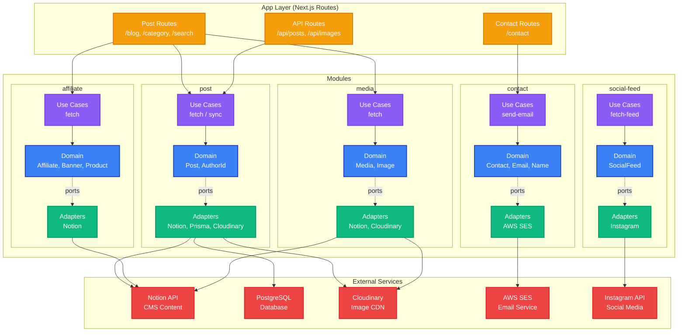
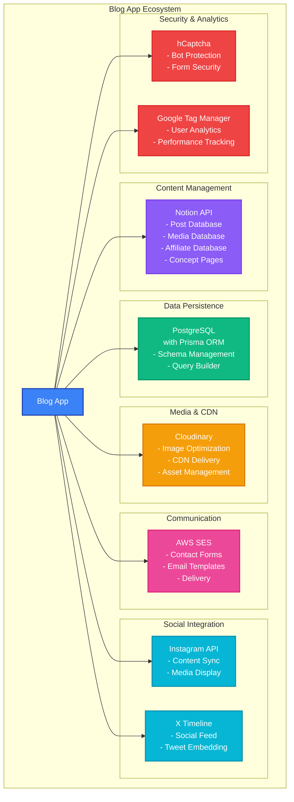

# K2BG Blog

A **Next.js 15** blog application with **Notion CMS** integration, built following **Clean Architecture** and **Domain-Driven Design** principles. Part of the [K2BG Branding monorepo](../../README.md).

## Technology Stack

| Category | Technologies |
|---|---|
| **Framework** | Next.js 15, React 19, TypeScript |
| **Styling** | Tailwind CSS v4 |
| **Database** | PostgreSQL, Prisma ORM |
| **CMS** | Notion API |
| **Email** | AWS SES |
| **Image CDN** | Cloudinary |
| **State** | Zustand, TanStack React Query |
| **Forms** | React Hook Form, Zod, hCaptcha |
| **Templating** | Handlebars (email templates) |
| **Testing** | Vitest, Testing Library, MSW |
| **Linting** | Biome |
| **Docs** | Storybook 10 |

## Getting Started

### Prerequisites

- Node.js 18+
- pnpm 9.15.9+
- PostgreSQL (or Docker)

### Installation

From the monorepo root:

```bash
pnpm install
```

### Development

```bash
# From monorepo root
pnpm dev --filter=blog

# Or from this directory
pnpm dev
```

Open [http://localhost:3000](http://localhost:3000).

### Build

```bash
pnpm build
```

The build runs `prisma generate && next build` to ensure the Prisma client is up to date.

### Storybook

```bash
pnpm storybook
```

Opens on [http://localhost:6007](http://localhost:6007).

### Testing

```bash
pnpm test          # Run once
pnpm test:watch    # Watch mode
```

## Architecture

The blog follows a **Clean Architecture** pattern with vertical slicing by domain module. Each module encapsulates its own domain logic, use cases, and adapters.

### Domain Modules

| Module | Description |
|---|---|
| `post` | Blog post management, categories, search |
| `contact` | Contact form handling and email delivery |
| `media` | Media asset management |
| `affiliate` | Affiliate link and banner management |
| `social-feed` | Social media feed integration (Instagram) |

### Layer Structure

Each module follows the same layered structure:

```
modules/<module>/
  domain/
    entities/          # Domain entities
    value-objects/     # Value objects with validation
    repositories/      # Repository interfaces (ports)
    types/             # Domain types
    errors/            # Domain-specific errors
  use-cases/
    query/             # Read operations (CQRS)
    command/           # Write operations (CQRS)
    sync/              # External data synchronization
  adapters/
    output/            # Infrastructure adapters (implementations)
```

### Use Cases

**Post**
- `fetch-posts` / `fetch-post` / `fetch-posts-by-category` / `fetch-all-slugs` / `search-posts`
- `sync-posts-from-external` / `sync-hero-images`

**Contact**
- `send-email`

**Affiliate**
- `fetch-affiliate` / `fetch-affiliates-by-ids` / `fetch-all-image-sources`

**Media**
- `fetch-media` / `fetch-all-image-sources`

**Social Feed**
- `fetch-feed`

### Adapters

| Adapter | Service | Used By |
|---|---|---|
| Notion | Notion API | post, affiliate, media |
| Prisma | PostgreSQL | post |
| Cloudinary | Cloudinary CDN | post, media |
| AWS SES | Amazon SES | contact |
| Instagram | Instagram API | social-feed |

### Clean Architecture Diagram



### External Services Integration



## Database

### Prisma Commands

```bash
npx prisma generate    # Generate Prisma client
npx prisma migrate dev # Run migrations
npx prisma studio      # Open database browser
```

### Docker Compose (Local PostgreSQL)

Start:

```bash
docker compose up -d
```

Stop:

```bash
docker compose down
```

Initial setup:

```bash
docker compose up -d
npx prisma migrate dev
```

Reset:

```bash
docker compose down
rm -rf .docker/postgres/data
docker compose up -d
npx prisma migrate dev
```

The Docker Compose configuration runs **PostgreSQL 15 Alpine** on port `5432` with database `k2bg_blog`.

## Environment Variables

Create `apps/blog/.env.local`:

```bash
# Notion CMS
NOTION_TOKEN=
NOTION_POST_DATABASE_ID=
NOTION_MEDIA_DATABASE_ID=
NOTION_AFFILIATE_DATABASE_ID=
NOTION_CONCEPT_PAGE_ID=

# Database
DATABASE_URL=

# Image Management
CLOUDINARY_CLOUD_NAME=
CLOUDINARY_API_KEY=
CLOUDINARY_API_SECRET=

# Email Service (AWS SES)
AMAZON_ACCESS_KEY_ID=
AMAZON_SECRET_ACCESS_KEY=
AMAZON_REGION=
AMAZON_SES_SENDER_EMAIL=

# Social Media
INSTAGRAM_LONG_ACCESS_TOKEN=
NEXT_PUBLIC_X_TIMELINE_URL=

# Security
NEXT_PUBLIC_H_CAPTCHA_SITE_KEY=
H_CAPTCHA_SECRET=

# Analytics
GOOGLE_TAG_MANAGER_ID=
```

## Project Structure

```
apps/blog/
├── app/                       # Next.js App Router
│   ├── api/                   # API routes (posts, images)
│   ├── blog/                  # Blog pages
│   ├── category/              # Category pages
│   ├── contact/               # Contact page
│   ├── search/                # Search page
│   ├── concept/               # Concept page
│   └── _mail-templates/       # Email templates (Handlebars)
├── modules/                   # Domain-driven modules
│   ├── post/                  # Post domain
│   ├── contact/               # Contact domain
│   ├── media/                 # Media domain
│   ├── affiliate/             # Affiliate domain
│   └── social-feed/           # Social feed domain
├── components/                # React components
├── infrastructure/            # External service clients
│   ├── aws-ses/               # AWS SES client
│   ├── cloudinary/            # Cloudinary client
│   ├── notion/                # Notion client
│   ├── prisma/                # Prisma client
│   ├── instagram/             # Instagram client
│   └── di/                    # Dependency injection
├── prisma/                    # Database schema & migrations
├── specs/                     # Domain specifications
├── .storybook/                # Storybook config
└── public/                    # Static assets
```
