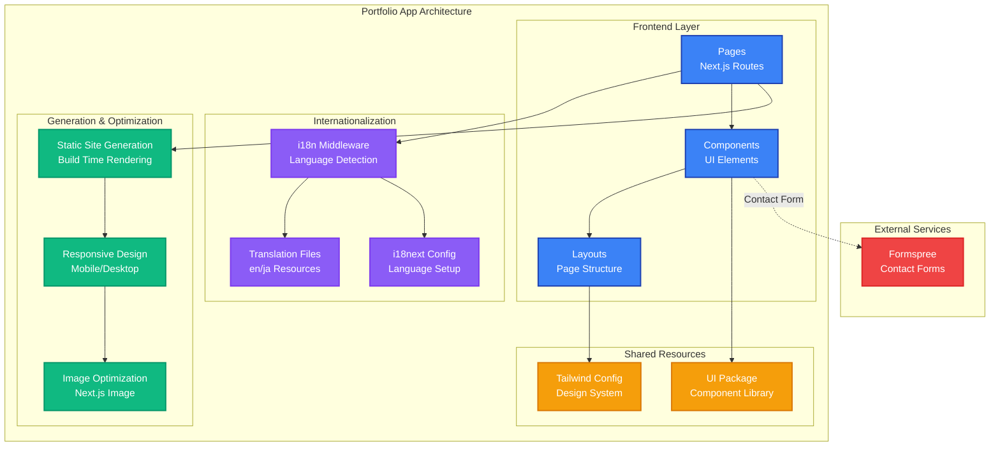

# K2BG Portfolio

A **Next.js 15** multilingual portfolio website supporting **English** and **Japanese**, with automatic language detection and i18n routing. Part of the [K2BG Branding monorepo](../../README.md).

## Technology Stack

| Category | Technologies |
|---|---|
| **Framework** | Next.js 15, React 19, TypeScript |
| **Styling** | Tailwind CSS v4 |
| **i18n** | i18next, react-i18next, i18next-browser-languagedetector |
| **Contact** | Formspree |
| **Analytics** | Google Tag Manager |
| **Linting** | Biome |
| **Docs** | Storybook 10 |

## Getting Started

### Prerequisites

- Node.js 18+
- pnpm 9.15.9+

### Installation

From the monorepo root:

```bash
pnpm install
```

### Development

```bash
# From monorepo root
pnpm dev --filter=portfolio

# Or from this directory
pnpm dev
```

Open [http://localhost:3001](http://localhost:3001).

### Build

```bash
pnpm build
```

### Storybook

```bash
pnpm storybook
```

Opens on [http://localhost:6008](http://localhost:6008).

## Architecture

### i18n System

| Setting | Value |
|---|---|
| **Languages** | Japanese (`ja`), English (`en`) |
| **Default / Fallback** | `ja` |
| **Cookie name** | `i18next` |
| **Detection priority** | path > htmlTag > cookie > navigator |

**Middleware behavior:**

1. Check `i18next` cookie for saved language preference
2. Fall back to `Accept-Language` header
3. Default to `ja` if no preference is detected
4. Redirect paths without a language prefix to `/{detected-language}{pathname}`
5. Update cookie from referer URL when present

All routes are prefixed with the language code (e.g., `/ja`, `/en`).

### Sections

The portfolio is a single-page application composed of these sections:

| Section | Description |
|---|---|
| **Hero** | Company name and slogan |
| **Background** | Personal background and certifications |
| **Skill** | Technical skills organized by category |
| **Portfolio** | Project showcase with videos and images |
| **Contact** | Contact form via Formspree |

### Components

- **LanguageSelector** - Language switcher (ja/en)
- **ScrollHelper** - Scroll navigation assistance
- **Slider** - Content slider for portfolio items
- **ExternalLinkButton** - External link component
- **Footer** - Site footer with attribution

### Custom Hooks

- **useMatchMedia** - Media query matching hook using `useSyncExternalStore` for SSR-safe responsive behavior

### Portfolio App Architecture



## Environment Variables

Create `apps/portfolio/.env.local`:

```bash
# Contact Form
FORMSPREE_FORM_ACTION_URL=

# Analytics
GOOGLE_TAG_MANAGER_ID=
```

## Project Structure

```
apps/portfolio/
├── app/
│   └── [lng]/                 # Language-specific routes
│       ├── layout.tsx         # Root layout with GTM
│       ├── page.tsx           # Main page (all sections)
│       └── loading.tsx        # Loading fallback
├── components/
│   ├── contents/              # Page sections
│   │   ├── Hero.tsx
│   │   ├── Background.tsx
│   │   ├── Skill.tsx
│   │   ├── Portfolio.tsx
│   │   └── Contact.tsx
│   ├── footer/                # Footer component
│   ├── LanguageSelector.tsx
│   ├── ScrollHelper.tsx
│   ├── Slider.tsx
│   └── ExternalLinkButton.tsx
├── hooks/
│   └── useMatchMedia.ts       # Responsive media query hook
├── i18n/
│   ├── settings.ts            # Language configuration
│   ├── client.ts              # Client-side i18n
│   ├── index.ts               # Server-side translation helper
│   └── locales/
│       ├── en/translation.json
│       └── ja/translation.json
├── middleware.ts               # Language detection & routing
├── public/
│   ├── images/                # Background and project images
│   └── videos/                # Portfolio demo videos
└── .storybook/                # Storybook config
```
