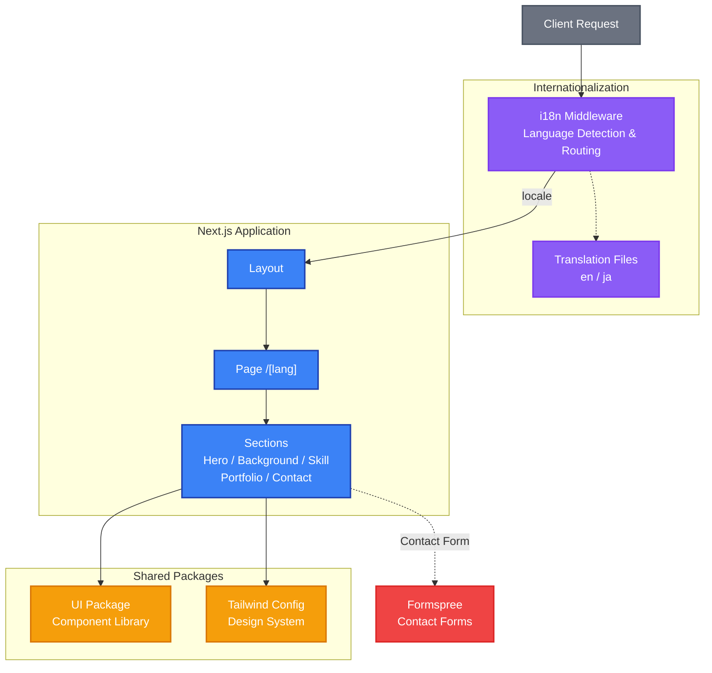

# K2BG Portfolio

A multilingual portfolio website supporting **English** and **Japanese**, with
automatic language detection and locale routing. Part of the
[K2BG Branding monorepo](../../README.md).

## Technology Stack

| Category | Technologies |
| --- | --- |
| **Framework** | Next.js, React, TypeScript |
| **Styling** | Tailwind CSS |
| **i18n** | Server-only dictionary loader |
| **Contact** | Formspree |
| **Analytics** | Google Tag Manager |
| **Linting** | Biome |
| **Docs** | Storybook |

## Getting Started

### Prerequisites

- Node.js 20.9+
- pnpm 10+

### Installation

From the monorepo root:

```bash
pnpm install
```

### Development

```bash
# From monorepo root
pnpm -F portfolio dev

# Or from this directory
pnpm dev
```

Open [http://localhost:3001](http://localhost:3001).

### Build

```bash
pnpm build
```

### Storybook

```bash
pnpm storybook
```

Opens on [http://localhost:6008](http://localhost:6008).

### Testing

```bash
pnpm test          # Run once
pnpm test:watch    # Watch mode
pnpm lint          # Run Biome checks
pnpm typecheck     # Run TypeScript checks
```

## Architecture

### i18n System

| Setting | Value |
| --- | --- |
| **Languages** | Japanese (`ja`), English (`en`) |
| **Default / Fallback** | `ja` |
| **Cookie name** | `NEXT_LOCALE` |
| **Detection priority** | cookie > `Accept-Language` header > fallback |

The edge-runtime `middleware.ts` handles locale detection and routing:

1. Check the `NEXT_LOCALE` cookie for a saved language preference
2. Fall back to `Accept-Language` header
3. Default to `ja` if no preference is detected
4. Redirect paths without a language prefix to `/{detected-language}{pathname}`
5. Write the locale in an already-prefixed path to the cookie, except for router prefetches

All routes are prefixed with the language code (e.g., `/ja`, `/en`).

### Sections

The portfolio is a single-page application composed of these sections:

| Section | Description |
|---|---|
| **Hero** | Company name and slogan |
| **Background** | Personal background and certifications |
| **Skill** | Technical skills organized by category |
| **Portfolio** | Project showcase with videos and images |
| **Contact** | Contact form via Formspree |

### Components

- **LanguageSelector** - Language switcher (ja/en)
- **ScrollHelper** - Scroll navigation assistance
- **Slider** - Content slider for portfolio items
- **ExternalLinkButton** - External link component
- **Footer** - Site footer with attribution

### Custom Hooks

- **useMatchMedia** - Media query matching hook using `useSyncExternalStore` for SSR-safe responsive behavior

### Portfolio App Architecture


```mermaid
flowchart TB
    Request["Client Request"] --> Middleware

    subgraph i18n["Internationalization"]
        direction TB
        Middleware["i18n Middleware<br/>Language Detection & Routing"]
        Translations["Translation Files<br/>en / ja"]
        Middleware -.-> Translations
    end

    subgraph app["Next.js Application"]
        direction TB
        Layout["Layout"] --> Page["Page /[lang]"]
        Page --> Sections["Sections<br/>Hero / Background / Skill<br/>Portfolio / Contact"]
    end

    subgraph shared["Shared Packages"]
        direction TB
        UIPackage["UI Package<br/>Component Library"]
        TailwindConfig["Tailwind Config<br/>Design System"]
    end

    Formspree["Formspree<br/>Contact Forms"]

    Middleware -->|locale| Layout
    Sections --> UIPackage
    Sections --> TailwindConfig
    Sections -.->|Contact Form| Formspree

    classDef requestStyle fill:#6B7280,stroke:#4B5563,stroke-width:2px,color:#fff
    classDef i18nStyle fill:#8B5CF6,stroke:#7C3AED,stroke-width:2px,color:#fff
    classDef appStyle fill:#3B82F6,stroke:#1E40AF,stroke-width:2px,color:#fff
    classDef sharedStyle fill:#F59E0B,stroke:#D97706,stroke-width:2px,color:#fff
    classDef externalStyle fill:#EF4444,stroke:#DC2626,stroke-width:2px,color:#fff

    class Request requestStyle
    class Middleware,Translations i18nStyle
    class Layout,Page,Sections appStyle
    class UIPackage,TailwindConfig sharedStyle
    class Formspree externalStyle
```

## Environment Variables

Create `apps/portfolio/.env.local`:

```bash
# Site
PORTFOLIO_SITE_BASE_URL=

# Google
GOOGLE_TAG_MANAGER_ID=

# Formspree (Contact Form)
NEXT_PUBLIC_FORMSPREE_FORM_ACTION_URL=
```

## Project Structure

```
apps/portfolio/
├── app/
│   └── [lang]/                # Language-specific routes
│       ├── layout.tsx         # Root layout with GTM
│       ├── page.tsx           # Main page (all sections)
│       └── loading.tsx        # Loading fallback
├── components/
│   ├── contents/              # Page sections
│   │   ├── Hero.tsx
│   │   ├── Background.tsx
│   │   ├── Skill.tsx
│   │   ├── Portfolio.tsx
│   │   └── Contact.tsx
│   ├── footer/                # Footer component
│   ├── LanguageSelector.tsx
│   ├── ScrollHelper.tsx
│   ├── Slider.tsx
│   └── ExternalLinkButton.tsx
├── hooks/
│   └── useMatchMedia.ts       # Responsive media query hook
├── i18n/
│   ├── settings.ts            # Language configuration
│   ├── dictionaries.ts        # Server-only dictionary loader
│   └── locales/
│       ├── en/translation.json
│       └── ja/translation.json
├── middleware.ts               # Language detection & routing
├── public/
│   ├── images/                # Background and project images
│   └── videos/                # Portfolio demo videos
└── .storybook/                # Storybook config
```
